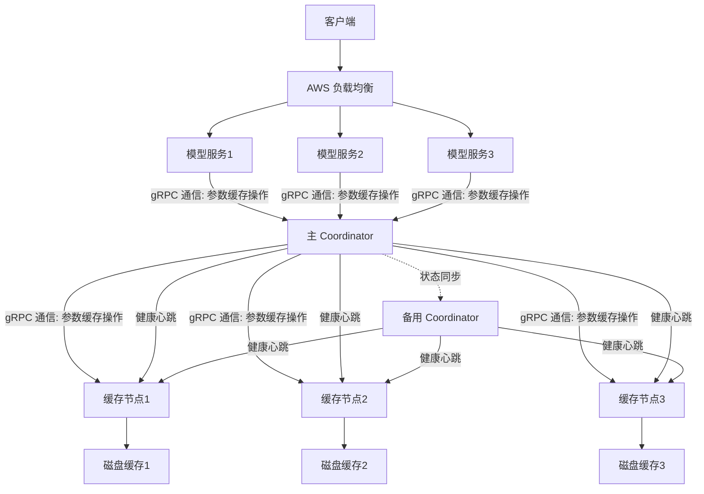

以下是为 **OptiCache** 项目编写的专业 `README.md` 模板，您可以根据实际需求进一步调整和补充。

---

# OptiCache

**OptiCache** 是一个高性能、分布式的参数缓存系统，专为高并发、低延迟的应用场景设计。通过 gRPC 通信和智能缓存节点调度，OptiCache 显著提升了参数缓存的读写性能，是替代传统数据库缓存的理想选择。

---

## **核心特性**

- 🚀 **高性能**：平均写入时间 **0.8 秒**，平均读取时间 **0.21 秒**，比 AWS DocumentDB 快 **5.4 倍（写入）** 和 **1.76 倍（读取）**。
- 🌐 **分布式架构**：支持多缓存节点和主备 Coordinator，确保系统的高可用性和可扩展性。
- 🔗 **gRPC 通信**：基于 gRPC 的高效通信协议，支持低延迟、高并发的参数缓存操作。
- 💾 **持久化存储**：缓存节点将数据持久化到磁盘，确保数据在系统重启或故障时不丢失。
- ⚙️ **智能调度**：Coordinator 负责缓存节点的健康检查和请求分发，确保系统的高效运行。

---

## **性能对比**

| **指标**       | **OptiCache** | **AWS DocumentDB** | **性能提升** |
|----------------|---------------|---------------------|--------------|
| **平均写入时间** | 0.8 秒        | 4.3 秒              | **5.4 倍**   |
| **平均读取时间** | 0.21 秒       | 0.37 秒             | **1.76 倍**  |

---

## **架构设计**



---

## **快速开始**

### 1. 克隆仓库

```bash
git clone https://github.com/leepand/OptiCache.git
cd OptiCache
cd opticache/proto && python -m grpc_tools.protoc -I. --python_out=. --grpc_python_out=. cache.proto

```

### 2. 安装依赖

确保已安装以下依赖：
- Go (版本 1.20+)
- gRPC
- Protobuf 编译器

安装依赖：

```bash
make install-deps
```

### 3. 编译和运行

编译项目：

```bash
make build
```

启动服务：

```bash
make run
```

### 4. 测试性能

运行性能测试脚本：

```bash
make benchmark
```

---

## **配置说明**

配置文件位于 `config/config.yaml`，主要配置项包括：

```yaml
coordinator:
  primary: "127.0.0.1:50051"
  secondary: "127.0.0.1:50052"

cache_nodes:
  - address: "127.0.0.1:6001"
    disk_path: "/data/cache1"
  - address: "127.0.0.1:6002"
    disk_path: "/data/cache2"
  - address: "127.0.0.1:6003"
    disk_path: "/data/cache3"
```

---

## **API 文档**

OptiCache 提供以下 gRPC API：

### 写入缓存

```protobuf
rpc WriteCache(WriteRequest) returns (WriteResponse);
```

### 读取缓存

```protobuf
rpc ReadCache(ReadRequest) returns (ReadResponse);
```

### 更新缓存

```protobuf
rpc UpdateCache(UpdateRequest) returns (UpdateResponse);
```

### 删除缓存

```protobuf
rpc DeleteCache(DeleteRequest) returns (DeleteResponse);
```

详细 API 定义见 [api.proto](./proto/api.proto)。

---

## **贡献指南**

我们欢迎贡献！请参阅 [CONTRIBUTING.md](./CONTRIBUTING.md) 了解如何参与开发。

---

## **许可证**

OptiCache 采用 [MIT 许可证](./LICENSE)。

---

## **联系我们**

如有任何问题或建议，请通过以下方式联系我们：
- 邮箱：support@opticache.com
- GitHub Issues: [https://github.com/leepand/OptiCache/issues](https://github.com/leepand/OptiCache/issues)

---

**OptiCache** - 让缓存更快、更智能！ 🚀

--- 

将此内容保存为 `README.md` 文件，并根据您的实际项目细节进行调整。